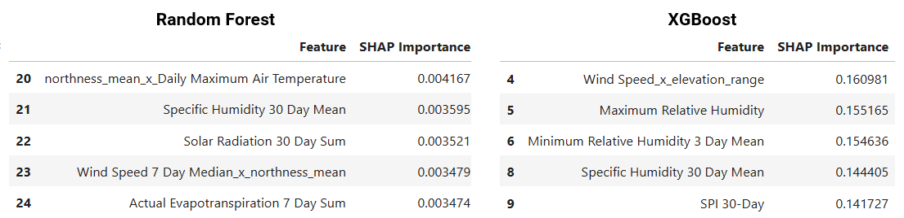

<link rel="stylesheet" href="notebooks/styles.css">

  <h1 class="title-main" style="font-weight: bold; font-size: 2.05rem;margin-top: -.7rem;margin-bottom: 0.24rem;">
  Spatial Data Science Approaches to Wildfire Severity Modeling
</h1>
<h2 class="title-sub" style="font-style: italic; font-size: 1.1rem; margin-top: 0rem; margin-bottom: 0.5rem;">
  A GIS‑Driven, Tree‑Based Machine Learning Analysis of California Wildfires
</h2>

**Author**: Dustin Littlefield\
**Project Type**: `Spatial Data Science`, `Natural Resources`, `Wildfire Analysis`\
**Technologies**: `ArcGIS` `Python` `Pandas` `Scikit-learn` `XGBoost` `Random Forest` `GeoPandas` `Matplotlib`\
**Last Updated:** March 28, 2026

## Overview
The goal of this project is to use machine learning to analyze how environmental, geographical, social, and temporal factors influence wildfire ignition across California.

<figure>  <figcaption><em>Figure 1: Damaging wildfires in California 01/01/2018 to 01/23/2025</em></figcaption> </figure>

## Objectives
- Predict and model wildfire **ignition** risk based on environmental, topographical, geographical and social data
- Analyze daily time series data spanning **6 years** of California wildfire history and weather
- Integrate **ArcGIS** for spatial analysis, results interpretation, and to aid in the construction of the dataset
- Compare classification modeling techniques with a focus on tree models like `XGBoost` and `Random Forest`
- Use `SHAP` and `Feature Ablation` to analyze and identify the most important relationships between weather factors and wildfire

## Data Sources

### Fire Incident Data

 - **Wildfire damage data**: *CAL FIRE Damage Inspection (DINS)* <https://data.ca.gov/dataset/cal-fire-damage-inspection-dins-data>'
 - **Wildfire incidents**: *Calfire Incidents* <https://www.fire.ca.gov/incidents>

### Environmental Data

- **Daily weather readings**: *gridMET* <https://www.climatologylab.org/gridmet.html>
- **Land cover**: *USGS* <https://data.cnra.ca.gov/dataset/nlcd-2021-land-cover-california-subset/resource/6dab6b30-88ae-4aec-af8c-c22d52593c75>
- **Daily NDVI rasters**: *NOAA* <https://doi.org/10.25921/gakh-st76>

### California Demographic Data

 - **Census tract and block data**: *U.S. Census Bureau, Department of Commerce* <https://catalog.data.gov/dataset/tiger-line-shapefile-2021-state-california-census-tracts>
 - **2024 American Community Survey 5 year median income data** *U.S. Census Bureau, Department of Commerce* <https://data.census.gov/table/ACSST1Y2024.S1903?q=California+Income&g=010XX00US$1500000_040XX00US06$1400000,06$1500000>

### Wildlife Urban Interface

- **WUI layer**: *California Department of Forestry and Fire Protection* <https://gis.data.ca.gov/datasets/CALFIRE-Forestry::wildland-urban-interface/explore?location=34.403601%2C-118.894358%2C9.95>
- **CDFW regions**: *California Department of Fish and Wildlife* <https://data.ca.gov/dataset/cdfw-regions>
- **Eco regions** - *USDA Forestry Service* <https://data.fs.usda.gov/geodata/edw/datasets.php?dsetCategory=biota>

### Elevation

- **1/3 arc-second DEMs**: *USGS National Map* <https://apps.nationalmap.gov/downloader/>

### Infrastructure 

- **All public roads**: *CalTrans* <https://apps.nationalmap.gov/downloader/>
- **Transmission lines**: *California Energy Commission (CEC)* <https://www.arcgis.com/home/item.html?id=aaa6321660eb40bbb55755d5cfb64107>

## Key Features
- `Climate Variables` - Air Temperature, Vapor Pressure Deficit, Humidity, Wind Speed, Evapotranspiration extractd from TerraClimate data.

- `Indicators` - Burning Index, Energy Release Component, 100 and 1000 Hour Dead Fuel Moisture, NDVI Temperature

- `Environmental Data` - Road Density, Power Line Density, Population and Housing Density, Median Income, WUI Interface Zones, Eco Regions, Slope, Aspect, Land Cover

- `Engineered Data` Santa Ana Score, 3 Day Averages, Interaction Features

## Methods
### Feature Engineering
- Constructed a **relative NDVI hot spot index** comparing each grids local mean to the global mean
- Created **interaction features** focused on targeted combinations of weather features and social data

### Modeling
To avoid temporal leakage, tuning is performed with a temporal split of data. Automatic functions use the macro (F1) metric to adjust for the best model performance. Ultimately, parameters are selected that best balance model and hardware performance.
- Models used `Random Forest` from scikit-learn, `XGBoost` from XGBoost
- Automatic hypertuning for optimal performance based on macro F1 scores
- Metrics evaluated: `F1-score (macro-averaged)`

<figure>  <figcaption><em>Figure 4: XGBoost learning rate hypertuning results</em></figcaption> </figure>

### Spatial Interpolation
- Generated a sampling grid throughout California for demographic, terrain, and elevation data
- Built a **custom ArcGIS Pro automation tool** to standardize output workflow and consistency

## Key Findings
- the models are quite good at reliably identifying **low‑risk** grids, largely because the patterns associated with 'no wildfire activity' are abundant, consistent, and easy for algorithms to learn.
- **Population density** in wildland intermix zones are the top drivers of the XGB wildfire ignition model. 
- Overall, the intersection of **human habitation** and **infrastructure** with **dense forests** weigh heavily in all models. Notably in areas where there are both dense **power lines** and **roads**. 
- Indicators of *drought* and *dry fuel materials* are the leading drivers among environmental factors.

### Weather Influence
<figure>  <figcaption><em>Figure 2: Top 5 contributing weather features</em></figcaption> </figure>

### Metrics 
<figure>  <figcaption><em>Figure 5: Model metrics of test set</em></figcaption> </figure>

### SHAP Feature Influence
<figure>  <figcaption><em>Figure 6: Top feature importance rankings by model</em></figcaption> </figure>

## Case Study Visualization

### **Wildfire *Ignition* Predictions:**

<figure>  <figcaption><em>Figure 7: Tree model wildfire ignition predictions compared to target results on 01/07/2025</em></figcaption> </figure>

- The intersection of **Wildland Urban Interface** and **Infrastructure** features contribute the most in both fire ignition models.
- **1000-hour Dead Fuel Moisture** is the highest performing weather feature. Long term dryness is the main driving factor for ignition.
