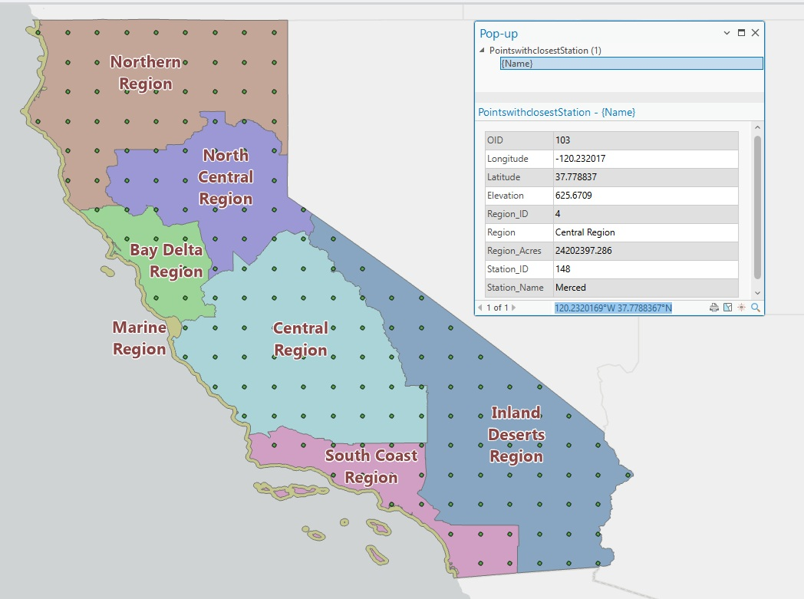
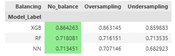

# Mapping the Potential Destructive Power of Wildfires Using Machine Learning
*Version 3.0*

Author: Dustin Littlefield\
Project Type: Data Science & GIS Portfolio\
Technologies: ArcGIS, Python, Pandas, Scikit-learn, XGBoost, GeoPandas, Matplotlib\
Skills: `Data cleaning` `feature engineering` `supervised machine learning` `model evaluation` `class imbalance handling` \
`spatial visualization` `exploratory data analysis` `reproducible workflow design` `results communication`\
Status: In Progress\
Last Updated: December 2025\
[Github Repository](https://github.com/dustinlit/California_Fire_Severity)

## Overview
This project is a work in progress that explores the relationship between environmental and weather-related factors and wildfire severity in California. The goal is to predict a custom severity index `Wildfire Potential Destructive Power` — which incorporates structures damaged, structures destroyed, and fatalities.

**Disclaimer:** I am not a climate scientist or wildfire expert. This project is intended to demonstrate data science, geospatial, and machine learning skills. It is not designed for operational use or policy decisions.

### Version 3.0 Changelog
> 1. New more accurate and complete weather data from **gridMET Climatology Lab**
> 2. Integration of **Wildland Urban Interface** and **California Eco regions**.
> 2. Replaced `KNN` model with a `Neural Network` for a simpler data workflow.
> 3. ArcGIS Pro integration for data preparation and prediction interpolation
> 4. Added more accurate Census Block data. Population stats calculated as buffer zone around sampling points.

### Version 2.0 Changelog
> 1. Added Detailed fire damage data
>       - CALFIRE damage cost data added
>       - Estimate cost of damage from damage to structures
>       - More accurate target
>       - Attaches significance to fires that cause damage only
> 2. Expanded the dates for weather and damage data
>       - Expanded from 2018-2020 to 2018-2025
> 3. New Features
>       - `Fire History` average fires per month for previous years
>       - `Dryness Indicator` rolling count of days without rain
> 4. Data Handling Optimization
>       - Simplified handling of case study data as references instead of storing separate databases
> 5. Geographical and Temporal Integration
>       - in ArcGIS, constructed a mesh sampling grid in California to ensure even coverage
>       - Buffer spatial join for combining fire damage info with weather data
>       - Incorporated Regionality and Seasonality into models

## Objectives
- Predict wildfire damage potential based on environmental, geographical and social data.
- Test classification models using resampling techniques to handle class imbalance.
- Create geospatial *interpolation visualizations* to illustrate regional risk patterns.
- Explore second-degree feature interactions and correlation to improve model features.

#### Example ArcGIS Output:

## Project Structure

California_Fire_Severity/\
├── data/\
├── notebooks/\
│ ├── 01_Data_Exploration_Processing.ipynb\
│ ├── 02_Data_Merging.ipynb\
│ ├── 03_Feature_Engineering.ipynb\
│ ├── 04_Variable_Selection.ipynb\
│ ├── 05_Feature_Interaction_Analysis.ipynb\
│ ├── 06_Class_Balancing.ipynb\
│ ├── 07_Modeling_and_Tuning.ipynb\
│ ├── 08_Evaluation_and_Visualization.ipynb\
│ ├── A_Appendix_Sampling_Points.ipynb\
│ ├── B_Appendix_Wildfires.ipynb\
│ ├── C_Appendix_Gridmet_Combination.ipynb\
│ ├── D_Appendix_Gridmet_Extraction.ipynb\
├── plots/\
│ ├── Palisades_predictions.png\
│ ├── Interpolated.png\
│ ├── sampling_metrics.png\
│ └── file_structure.png\
├── src/\
├── Optimizing_Emergency_Response.pdf\
├── README.ipynb\
└── README.md

### Data Sources

> **Fire Incident Data**:
> - *CAL FIRE Damage Inspection (DINS)* Data: <https://data.ca.gov/dataset/cal-fire-damage-inspection-dins-data>'
> - *Calfire Incident* Data: <https://www.fire.ca.gov/incidents>\

> **Weather Data**:
> - *gridMET* - <https://www.climatologylab.org/gridmet.html>

> **California Demographic Data** 
> - *U.S. Census Bureau, Department of Commerce*: Population <https://catalog.data.gov/dataset/tiger-line-shapefile-current-state-california-2020-census-block>

> **Wildlife Urban Interface**: 
> - *California Department of Forestry and Fire Protection*: <https://gis.data.ca.gov/datasets/CALFIRE-Forestry::wildland-urban-interface/explore?location=34.403601%2C-118.894358%2C9.95>
> - *California Department of Fish and Wildlife*: <https://data.ca.gov/dataset/cdfw-regions>

## Data Processing

**Raw Data Processed in:**
> - *notebooks/A_Appendix_Sampling_Points.ipynb*
> - *notebooks/B_Appendix_Wildfires.ipynb*
> - *notebooks/C_Appendix_Gridmet_Combination.pynb*
> - *notebooks/D_Appendix_Gridmet_Extraction.pynb*

#### **Key Variables Used**:
Environmental / Weather Variables:
- `Air Temperature`-	Maximum air temperature at 2 meters above ground (Kelvin)
- `Vapor Pressure Deficit` - kPa Difference between saturation vapor pressure and actual vapor pressure (kPa); indicates atmospheric drying power
- `Relative Humidity`	-Maximum daily relative humidity (%) at 2 meters
- `Wind Speed` - Daily wind speed (m/s) at 10 meters
- `Actual Evapotranspiration`	- Estimated evapotranspiration from actual vegetation (mm/day)
- `Palmer Drought Severity Index`	- Long-term drought index combining temperature and precipitation to measure dryness
- `Standardized Precipitation Index` - Short-term precipitation deficit; captures recent drying of fine fuels

Fire Danger Indicators:
- `Burning_Index`	- Fire danger index derived from temperature, humidity, wind, and fuel moisture; higher values indicate higher fire potential
- `Energy_Release_Component` - Estimated energy release per unit area (MJ/m²); relates to potential fire intensity
- `Dead_Fuel_Moisture` - Moisture content of medium-size dead fuels (%) affecting fire spread

Mesh Network Data:
- `Interface`, `Intermix`, and `Influence` Areas - From WUI, average area of each zone within 36KM Buffer radius around sampling points
- `Total_Population` and `Population_Density` - Population statistics within 36KM Buffer radius around sampling points
- `Total_Housing` and `Housing_Density` - Housing statistics within 36KM Buffer radius around sampling points
- `Eco_Regions` - regions generally representing the varied climate and vegetative regions in California

#### **ArcGIS Mesh Network:**

  

## Feature Engineering
*Located in:* 
> - *notebooks/03_Feature_Engineering.ipynb*
> - *notebooks/04_Variable_Selection.ipynb*
- Created rolling averages for environmental variables.
- Created 2-year averages of fires per month per county

Engineered Data: 
- `Average_Fires_per_Month` - Historical 2 year rolling average count of fires per county

## Class Balancing
*Located in:* 
> - *notebooks/06_Class_Balancing.ipynb*

**Target:** *Wildlife Potential Destructive Power* - categorized into Low (0), Moderate(1), High(1)

**Issues:** Moderate and High Damage wildfire events classes are underrepresented.

Balancing Techniques Used:
- In method class balancing
- Random UnderSampler for the dominant "Low" class.
- SMOTE for oversampling

Automatic comparison and selection of class balancing strategies.

## Modeling
*Located in:*
> - *notebooks/07_modeling_And_Tuning.ipynb*

Models are tuned automatically and the best performing models are selected for final evaluation and visualization.

**Models tested:**
- `Random Forest` from scikit-learn
- `Neural Network` from scikit-learn
- `XGBoost` from XGBoost

**Metrics evaluated:**
`F1-score (macro-averaged)`
`Confusion matrices`
`Cross-validation`

Feature importance extracted for tree-based models.

## Visualization
*Located in:*
> - *notebooks/08_evaluation_and_visualization.ipynb*

- Maps using GeoPandas, Matplotlib, and Seaborn.
- IDW interpolation for environmental variables in ArcGIS.

Example Python Output:

## Key Results

**Key Findings:** \
All Models struggle with distinguishing **Moderate** from **High** severity classes.\
Class balancing significantly improved recall for minority classes.

Conclusions:
- Weather Variables rank low on model importance suggesting a more complicated relationship with wildfire severity
- Population Indicators play a key role in prediciting wildfire severity

## Challenges

> **Weak Correlation** – Environmental features don’t fully explain severity outcomes.\
> **Class Imbalance** – Damaging fires are rare; balancing was essential.\
> **Limited Processing Power** - Limits the granularity of the sampling mesh and increases modeling time due to larger datasets.\
> **Data Incompatability** - Interpreting some more complex factors like reservoir levels and response times is complicated due to missing and spatially uncorrelated data.

## Next Steps / Potential Improvements
- Arcpy integration.
- Incorporate emergency response times and reservoir data
- Time series maps to check models consistency over time
- Seperate module for up to date processing of new information and real time predictions
- Consult domain experts to validate assumptions and feature selection.

## Installation
To run the project locally:\
git clone https://github.com/dustinlit/wildfire-severity.git \
cd wildfire-severity\
pip install -r requirements.txt

## License
This project is released under the MIT License.
See LICENSE for details.