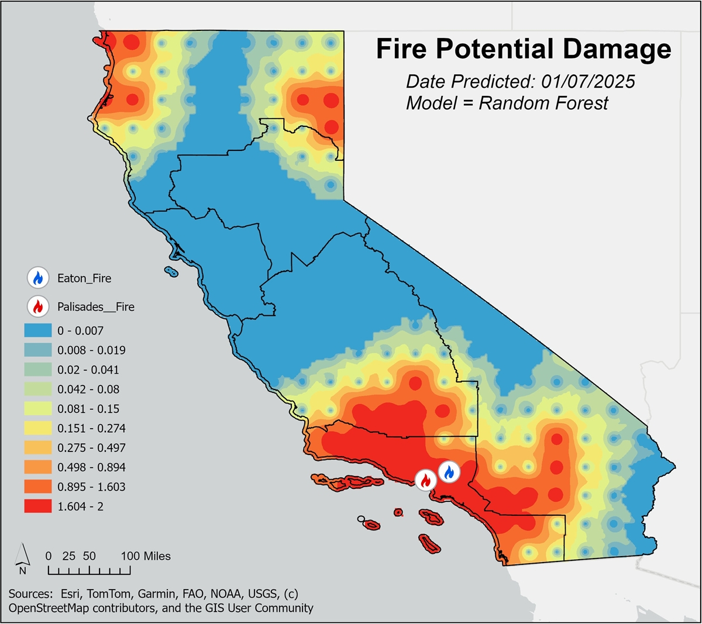
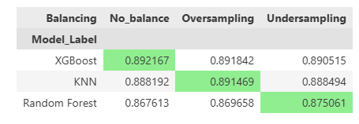

# Mapping the Potential Destructive Power of Wildfires Using Machine Learning
*Version 2.0*

Author: Dustin Littlefield\
Project Type: Data Science & GIS Portfolio\
Technologies: Python, Pandas, Scikit-learn, XGBoost, GeoPandas, Matplotlib\
Skills: `Data cleaning` `feature engineering` `supervised machine learning` `model evaluation` `class imbalance handling` \
`spatial visualization` `exploratory data analysis` `reproducible workflow design` `results communication`\
Status: In Progress\
Last Updated: November 2025\
Repository: https://github.com/dustinlit/California_Fire_Severity

## Overview
This project is a work in progress that explores the relationship between environmental and weather-related factors and wildfire severity in California. The goal is to predict a custom severity index `Wildfire Potential Destructive Power` — which incorporates structures damaged, structures destroyed, and fatalities.

**Disclaimer:** I am not a climate scientist or wildfire expert. This project is intended to demonstrate data science, geospatial, and machine learning skills. It is not designed for operational use or policy decisions.

> ### Version 2.0 Features
> 1. Added Detailed fire damage data
>       - CALFIRE damage cost data added
>       - Estimate cost of damage from damage to structures
>       - More accurate target
>       - Attaches significance to fires that cause damage only
> 2. Expanded the dates for weather and damage data
>       - Expanded from 2018-2020 to 2018-2025
> 3. New Features
>       - `Fire History` average fires per month for previous years
>       - `Dryness Indicator` rolling count of days without rain
> 4. Data Handling Optimization
>       - Simplified handling of case study data as references instead of storing separate databases
> 5. Geographical and Temporal Integration
>       - in ArcGIS, constructed a mesh sampling grid in California to ensure even coverage
>       - Buffer spatial join for combining fire damage info with weather data
>       - Incorporated Regionality and Seasonality into models

## Objectives
- Predict wildfire damage potential based on environmental, geographical and social data.
- Test classification models using resampling techniques to handle class imbalance.
- Create geospatial *interpolation visualizations* to illustrate regional risk patterns.
- Explore second-degree feature interactions and correlation to improve model features.
---
Example Output:

## Project Structure

California_Fire_Severity/\
├── data/\
├── notebooks/\
│ ├── 01_Fire_Damage_Processing.ipynb\
│ ├── 02_Weather_Data_Processing.ipynb\
│ ├── 03_Feature_Engineering.ipynb\
│ ├── 04_Variable_Selection.ipynb\
│ ├── 05_Feature_Interaction_Analysis.ipynb\
│ ├── 06_Class_Balancing.ipynb\
│ ├── 07_Modeling_and_Tuning.ipynb\
│ ├── 08_Evaluation_and_Visualization.ipynb\
│ ├── A_Appendix.ipynb\
├── plots/\
│ ├── Palisades_predictions.png\
│ ├── Interpolated.png\
│ ├── sampling_metrics.png\
│ └── file_structure.png\
├── src/\
├── Optimizing_Emergency_Response.pdf\
├── README.ipynb\
└── README.md

---

### Data Sources

**Fire Incident Data** – includes structure and fatality impact measures. \
**California CIMIS Weather Data** – daily temperature, wind speed, precipitation, humidity. \
**California Demographic Data** - population density and mean income by county obtained from 2020 US census, proxy for firefighting resources \
**GIS Layers** – Californa shapefiles for spatial visualization.

---

## Data Processing

*Located in:* 
> - *notebooks/01_Fire_Damage_Processing.ipynb*
> - *notebooks/02_Weather_Data_Processing.ipynb*
> - *notebooks/A_Appendix.pynb*

- ArcGIS, constructed an equally spaced grid of sampling points for overall better coverage.
- Merged detailed fire records with sampling points via intersect spatial join.
- Imputed missing values for weather stations.

#### Key Factors Used:
**Environmental / Weather Variables**
- `Avg Air Temp (F)` – represents heat conditions.
- `Avg Vap Pres (mBars)` – Average vapor pressure; indicates atmospheric moisture.
- `Avg Rel Hum (%)` – affects fire ignition and spread.
- `Avg Wind Speed (mph)` – higher speeds can drive fire spread.
- `Precip (in) 7 Day Avg` – Total precipitation in the past 7 days; influences fuel moisture.
- `ETo (in)` – Reference evapotranspiration; approximates water loss from soil and plants.

---

## Feature Engineering
*Located in:* 
> - *notebooks/03_Feature_Engineering.ipynb*
> - *notebooks/04_Variable_Selection.ipynb*
> - *notebooks/05_Feature_Interaction_Analysis.pynb*
- Created rolling averages for environmental variables.
- Engineered interaction features.

#### Engineered Features Used:
**Derived / Interaction Features**
- `ETo_x_Vapor_Pressure` – Interaction between evapotranspiration and vapor pressure; models combined dryness effects.
- `ETo_x_Temp` – Interaction between evapotranspiration and air temperature; highlights hot, dry conditions.
- `Vapor_Pressure_x_Temp` – Interaction capturing the combined effect of heat and moisture.
- `Vapor_Pressure_x_Wind_Speed` – Interaction between wind and atmospheric moisture; affects drying conditions.

**Composite Index**
- `Dryness` – Custom dryness proxy combining weather variables; designed to approximate vegetation or fuel dryness.
- `Days Without Rain` - Simple rolling count indicating drought conditions
- `2 Year Fire History` - Average fires per month in the geographic vicinity in last two years.

---

## Class Balancing
*Located in:* 
> - *notebooks/06_Class_Balancing.ipynb*

**Target:** *Wildlife Potential Destructive Power* - categorized into Low (0), Moderate(1), High(1)

**Issues:** Moderate and High Damage wildfire events classes are underrepresented.

Balancing Techniques Used:
- In method class balancing
- Manual undersampling of the dominant "Low" class.
- SMOTE for oversampling

Comparison of model performance across balancing strategies.

---

## Modeling
*Located in:*
> - *notebooks/07_modeling_And_Tuning.ipynb*

Models are tuned automatically and the best performing models are selected for final evaluation and visualization.

**Models tested:**
`Random Forest`
`K-Nearest Neighbors`
`XGBoost`

**Metrics evaluated:**
`F1-score (macro-averaged)`
`Confusion matrices`
`Cross-validation`

Feature importance extracted for tree-based models.

---

## Visualization
*Located in:*
> - *notebooks/08_evaluation_and_visualization.ipynb*

- Maps using GeoPandas, Matplotlib, and Seaborn.
- IDW interpolation for environmental variables in ArcGIS.

Example Output:

---

## Key Results

**Key Findings:** \
All Models struggle with distinguishing **Moderate** from **High** severity classes.\
Class balancing significantly improved recall for minority classes.

---

## Challenges

**Missing Environmental Data** – Gaps in weather stations required imputation.\
**Weak Correlation** – Environmental features don’t fully explain severity outcomes.\
**Class Imbalance** – Damaging fires are rare; balancing was essential.\
**Derived Variable Uncertainty** – Proxies like Dryness need validation.\
**Spatial Generalization** – Models may not perform well across regions.

---

## Next Steps / Potential Improvements
- Add land cover, topography, and WUI datasets.
- ArcGIS integration.
- Incorporate emergency response times
- Time series maps to check models consistency over time
- Seperate module for up to date processing of new information and real time predictions
- Consult domain experts to validate assumptions and feature selection.

---

## Installation
To run the project locally:\
git clone https://github.com/dustinlit/wildfire-severity.git \
cd wildfire-severity\
pip install -r requirements.txt

---

## License
This project is released under the MIT License.
See LICENSE for details.