<link rel="stylesheet" href="notebooks/styles.css">

  <h1 class="title-main" style="font-weight: bold; font-size: 2.05rem;margin-top: -.7rem;margin-bottom: 0.24rem;">
  Spatial Data Science Approaches to Wildfire Severity Modeling
</h1>
<h2 class="title-sub" style="font-style: italic; font-size: 1.1rem; margin-top: 0rem; margin-bottom: 0.5rem;">
  A GIS‑Driven, Tree‑Based Machine Learning Analysis of California Wildfires
</h2>

**Author**: Dustin Littlefield\
**Project Type**: `Spatial Data Science`, `Natural Resources`, `Wildfire Analysis`\
**Technologies**: `ArcGIS` `Python` `Pandas` `Scikit-learn` `XGBoost` `Random Forest` `GeoPandas` `Matplotlib`\
**Last Updated:** December 2025\
[Github Repository](https://github.com/dustinlit/California_Fire_Severity)

> **Disclaimer:** I am not a climate scientist or wildfire expert. This project is intended to demonstrate data science, geospatial, and machine learning skills. It is not designed for operational use or policy decisions.

## Overview
The goal of this project is to use machine learning to analyze how environmental, geographical, social, and temporal factors influence wildfire severity across California. Specifically, the project aims to model and predict wildfire ignition, spread, and damage, and to determine which factors contribute most to each stage of wildfire behavior.

## Objectives
- Predict wildfire **ignition, spread, and damage** based on environmental, topographical, geographical and social data.
- Extrapolate statewide wildfire coverage by integrating daily weather data and fire records through analysis of a grid network across California.
- Analyze daily time series data spanning **6 years** of California wildfire history and weather.
- Integrate ArcGIS for **spatial analysis**, results interpretation, and to aid in the construction of the dataset.
- Compare several multi-classification modeling techniques with a focus on tree models like `XGBoost` and `Random Forest`.
- Compare class balancing techniques like `RandomUnderSampler`, `SMOTE`, with unbalanced performance.
- Utilize interpolation techniques to create geospatial visualizations that illustrate local and regional wildfire risk patterns and key factors as they evolve over time.
- Use `SHAP` and `Feature Ablation` to Analyze and identify the most important relationships between wildfire severity and risk factors.

## Potential Applications
- **Targeted deployment of firefighting and prevention resources** When conditions indicate a higher likelihood of large or damaging wildfires, agencies can focus personnel and equipment in the areas that need them most.
- **Identifying high‑risk wildland–urban interface development zones** By estimating the potential financial impact of wildfire damage, proposed building sites can be compared and evaluated more effectively.

## Data Sources

**Fire Incident Data**:

 - **Wildfire damage data**: *CAL FIRE Damage Inspection (DINS)* <https://data.ca.gov/dataset/cal-fire-damage-inspection-dins-data>'
 - **Wildfire incidents**: *Calfire Incidents* <https://www.fire.ca.gov/incidents>

**Environmental Data**:

- **Daily weather readings**: *gridMET* <https://www.climatologylab.org/gridmet.html>
- **Land cover**: *USGS* <https://data.cnra.ca.gov/dataset/nlcd-2021-land-cover-california-subset/resource/6dab6b30-88ae-4aec-af8c-c22d52593c75>
- **Daily NDVI rasters**: *NOAA* <https://doi.org/10.25921/gakh-st76>

**California Demographic Data** :

 - **Census tract and block data**: *U.S. Census Bureau, Department of Commerce* <https://catalog.data.gov/dataset/tiger-line-shapefile-2021-state-california-census-tracts>
 - **2024 American Community Survey 5 year median income data** *U.S. Census Bureau, Department of Commerce* <https://data.census.gov/table/ACSST1Y2024.S1903?q=California+Income&g=010XX00US$1500000_040XX00US06$1400000,06$1500000>

**Wildlife Urban Interface**: 

- **WUI layer**: *California Department of Forestry and Fire Protection* <https://gis.data.ca.gov/datasets/CALFIRE-Forestry::wildland-urban-interface/explore?location=34.403601%2C-118.894358%2C9.95>
- **CDFW regions**: *California Department of Fish and Wildlife* <https://data.ca.gov/dataset/cdfw-regions>
- **Eco regions** - *USDA Forestry Service* <https://data.fs.usda.gov/geodata/edw/datasets.php?dsetCategory=biota>

**Elevation**: 

- **1/3 arc-second DEMs**: *USGS National Map* <https://apps.nationalmap.gov/downloader/>

**Infrastructure**: 

- **All public roads**: *CalTrans* <https://apps.nationalmap.gov/downloader/>
- **Transmission lines**: *California Energy Commission (CEC)* <https://www.arcgis.com/home/item.html?id=aaa6321660eb40bbb55755d5cfb64107>

**Raw Data Processing in:**
> - [*notebooks/A_Appendix_Sampling_Grids.ipynb*](https://github.com/dustinlit/California_Fire_Severity/blob/main/notebooks/A_Appendix_Sampling_Grids.ipynb)
> - [*notebooks/B_Appendix_Wildfires.ipynb*](https://github.com/dustinlit/California_Fire_Severity/blob/main/notebooks/B_Appendix_Wildfires.ipynb)
> - [*notebooks/C_Appendix_Gridmet_Combination.pynb*](https://github.com/dustinlit/California_Fire_Severity/blob/main/notebooks/C_Appendix_Gridmet_Combination.ipynb_)
> - [*notebooks/D_Appendix_Gridmet_Extraction.pynb*](https://github.com/dustinlit/California_Fire_Severity/blob/main/notebooks/D_Appendix_Gridmet_Extraction.ipynb)
> - [*notebooks/E_Appendix_NDVI_extraction.ipynb*](https://github.com/dustinlit/California_Fire_Severity/blob/main/notebooks/E_Appendix_NDVI_extraction.ipynb)
> - [*notebooks/F_Appendix_Raster_Processing.ipynb*](https://github.com/dustinlit/California_Fire_Severity/blob/main/notebooks/F_Appendix_Raster_Processing.ipynb)
> - [*notebooks/G_Appendix_Raster_Combination.ipynb*](https://github.com/dustinlit/California_Fire_Severity/blob/main/notebooks/G_Appendix_Raster_Combination.ipynb)
> - [*notebooks/H_Appendix_Reservoir_Data.ipynb*](https://github.com/dustinlit/California_Fire_Severity/blob/main/notebooks/H_Appendix_Reservoir_Data.ipynb)

## Methods
**Data Preparation:**
- All datasets collected from official state and federal sources
- All ArcGIS layers are projected to a common CRS (EPSG 3310) and clipped to California state boundaries.
 

**Feature Engineering:**
- Constructed a **relative NDVI hot spot index** comparing each grids local mean to the global mean
- Created **interaction features** focused on targeted combinations of weather features and the specific interactions of slope and wind.

**Modeling:**
- Trained tree based ML models to predict categorical **Damage**, **Spread**, and **Ignition** targets on individual pipelines.
- Automatic hypertuning for optimal performance based on macro F1 scores.

**Spatial Interpolation:**
- Built a **custom ArcGIS Pro automation tool** to standardize output workflow and consistency.
  - for a target date, runs kriging for the two prediction sets and one actual results set.
  - clips all output rasters to California boundaries

## Initial Insights
- Key wildfire dataset figures:
  - over **6 years of uninterupted** weather and wilfire data.
  - **608,880** total grids analyzed.
  -  over **100 million** datapoints represented. 
  - **44,992** wildfire ignitions
  - **21,263** wildfires with significant acres burned
  - **6,961** wildfires that caused significant property damage.
  - **> 500,000** grids that detected no significant wildfire events

- The current models, XGBoost and Random Forest, are achieving macro F1 scores of around 70% for *wildfire damage* and *wildfire spread* targets. This is a modest level of performance, likely constrained by the coarse spatial resolution of the sampling grid and the substantial regional variability in California’s climate.
- The models largely reinforce the common view of wildfire causes. 
  - **Population density** in wildland intermix zones are the top drivers of the XGB wildfire ignition model. 
  - Overall, the intersection of **human habitation** and **infrastructure** with **dense forests** weigh heavily in all models. Notably in areas where there are both dense **power lines** and **roads**. 
  - Indicators of *drought* and *dry fuel materials* are the leading drivers among environmental factors.
  - Large scale **wind speed** features alone appear to be of limited predictive ability for wildfire spread and damage. However, when interacting with **slope** a moderate influence is observed. More detailed wind gust data with a higher resolution may be necessary to truly account for the winds effects.

## Top SHAP Feature Contributions:

### **XGB Top 5 Contributing Weather Factors**

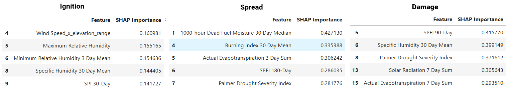

### **RF Top 5 Contributing Weather Factors**
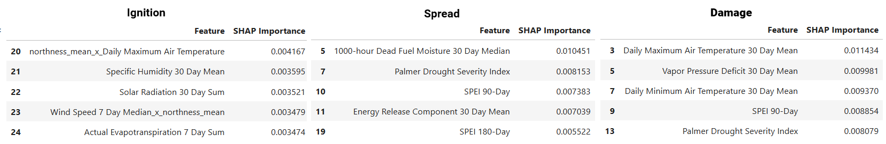

 

## Project Structure

<ul>
  <li>California_Fire_Severity/
    <ul>
      <li>data/
        <ul>
          <li>raw/</li>
          <li>processed/</li>
          <li>maps/</li>
          <li>output/</li>
          <li>plots/</li>
        </ul>
      </li>
      <li>src/
        <ul>
          <li>data_utils.py</li>
          <li>model_utils.py</li>
          <li>plot_utils.py</li>
        </ul>
      </li>
      <li>notebooks/
        <ul>
          <li>Data Exploration
            <ul>
              <li><a href="notebooks/01_Data_Exploration.ipynb">01_Data_Exploration.ipynb</a></li>
            </ul>
          </li>
          <li>Data Joining & Preprocessing
            <ul>
              <li><a href="notebooks/02_A_Weather_Data_Merging.ipynb">02_A_Weather_Data_Merging.ipynb</a></li>
              <li><a href="notebooks/02_B_Spatial_Join_Reservoirs.ipynb">02_B_Spatial_Join_Reservoirs.ipynb</a></li>
              <li><a href="notebooks/02_C_Spatial_Join_Fire_Data.ipynb">02_C_Spatial_Join_Fire_Data.ipynb</a></li>
              <li><a href="notebooks/03_Feature_Engineering.ipynb">03_Feature_Engineering.ipynb</a></li>
            </ul>
          </li>
          <li>Feature Analysis
            <ul>
              <li><a href="notebooks/04_A_Feature_Distributions.ipynb">04_A_Feature_Distributions.ipynb</a></li>
              <li><a href="notebooks/04_B_Class_Conditional_Feature_Distributions.ipynb">04_B_Class_Conditional_Feature_Distributions.ipynb</a></li>
              <li><a href="notebooks/04_C_Feature_Correlation.ipynb">04_C_Feature_Correlation.ipynb</a></li>
              <li><a href="notebooks/05_Subset_and_Split.ipynb">05_Subset_and_Split.ipynb</a></li>
            </ul>
          </li>
          <li>Modeling & Tuning
            <ul>
              <li><a href="notebooks/06_A_Fire_Ignition_Tuning.ipynb">06_A_Fire_Ignition_Tuning.ipynb</a></li>
              <li><a href="notebooks/06_B_Fire_Spread_Tuning.ipynb">06_B_Fire_Spread_Tuning.ipynb</a></li>
              <li><a href="notebooks/06_C_Fire_Damage_Tuning.ipynb">06_C_Fire_Damage_Tuning.ipynb</a></li>
              <li><a href="notebooks/07_A_Fire_Ignition_Class_Balancing.ipynb">07_A_Fire_Ignition_Class_Balancing.ipynb</a></li>
              <li><a href="notebooks/07_B_Fire_Spread_Class_Balancing.ipynb">07_B_Fire_Spread_Class_Balancing.ipynb</a></li>
              <li><a href="notebooks/07_C_Fire_Damage_Class_Balancing.ipynb">07_C_Fire_Damage_Class_Balancing.ipynb</a></li>
              <li><a href="notebooks/08_A_Fire_Ignition.ipynb">08_A_Fire_Ignition.ipynb</a></li>
              <li><a href="notebooks/08_B_Fire_Ignition_Feature_Ablation.ipynb">08_B_Fire_Ignition_Feature_Ablation.ipynb</a></li>
              <li><a href="notebooks/09_A_Fire_Spread.ipynb">09_A_Fire_Spread.ipynb</a></li>
              <li><a href="notebooks/09_B_Fire_Spread_Feature_Ablation.ipynb">09_B_Fire_Spread_Feature_Ablation.ipynb</a></li>
              <li><a href="notebooks/10_A_Fire_Damage.ipynb">10_A_Fire_Damage.ipynb</a></li>
              <li><a href="notebooks/10_B_Fire_Damage_Feature_Ablation.ipynb">10_B_Fire_Damage_Feature_Ablation.ipynb</a></li>
            </ul>
          </li>
          <li>Appendices
            <ul>
              <li><a href="notebooks/A_Appendix_Sampling_Grids.ipynb">A_Appendix_Sampling_Grids.ipynb</a></li>
              <li><a href="notebooks/B_Appendix_Wildfires.ipynb">B_Appendix_Wildfires.ipynb</a></li>
              <li><a href="notebooks/C_Appendix_Gridmet_Combination.ipynb">C_Appendix_Gridmet_Combination.ipynb</a></li>
              <li><a href="notebooks/D_Appendix_Gridmet_Extraction.ipynb">D_Appendix_Gridmet_Extraction.ipynb</a></li>
              <li><a href="notebooks/E_Appendix_NDVI_Extraction.ipynb">E_Appendix_NDVI_Extraction.ipynb</a></li>
              <li><a href="notebooks/F_Appendix_Raster_Processing.ipynb">F_Appendix_Raster_Processing.ipynb</a></li>
              <li><a href="notebooks/G_Appendix_Raster_Combination.ipynb">G_Appendix_Raster_Combination.ipynb</a></li>
              <li><a href="notebooks/H_Appendix_Reservoir_Data.ipynb">H_Appendix_Reservoir_Data.ipynb</a></li>
            </ul>
          </li>
        </ul>
      </li>
      <li><a href="README.md">README.md</a></li>
    </ul>
  </li>
</ul>

**Data Exploration and Processing:**
> - [*notebooks/01_Data_Exploration.ipynb*](https://github.com/dustinlit/California_Fire_Severity/blob/main/notebooks/01_Data_Exploration.ipynb)
> - [*notebooks/02_A_Weather_Data_Merging.ipynb*](https://github.com/dustinlit/California_Fire_Severity/blob/main/notebooks/02_A_Weather_Data_Merging.ipynb)
> - [*notebooks/02_B_Spatial_Join_Reservoirs.ipynb*](https://github.com/dustinlit/California_Fire_Severity/blob/main/notebooks/02_B_Spatial_Join_Reservoirs.ipynb)
> - [*notebooks/02_C_Spatial_Join_Fire_Data.ipynb*](https://github.com/dustinlit/California_Fire_Severity/blob/main/notebooks/02_C_Spatial_Join_Fire_Data.ipynb)

## Key Features
**Environmental / Weather Variables**:
- `Air Temperature`-	Daily maximum and minimum air temperature at 2 meters above ground (Kelvin)
- `Vapor Pressure Deficit` - kPa Difference between saturation vapor pressure and actual vapor pressure (kPa); indicates atmospheric drying power
- `Relative Humidity`	-Maximum daily relative humidity (%) at 2 meters
- `Wind Speed` - Daily wind speed (m/s) at 10 meters
- `Actual Evapotranspiration`	- Estimated evapotranspiration from actual vegetation (mm/day)
- `Palmer Drought Severity Index`	- Long-term drought index combining temperature and precipitation to measure dryness
- `Standardized Precipitation Index` - Short-term precipitation deficit; captures recent drying of fine fuels

**Fire Danger Indicators**:
- `Burning_Index`	- Fire danger index derived from temperature, humidity, wind, and fuel moisture; higher values indicate higher fire potential
- `Energy_Release_Component` - Estimated energy release per unit area (MJ/m²); relates to potential fire intensity
- `100 and 1000 Hour Dead_Fuel_Moisture` - Moisture content of medium-size dead fuels (%) affecting fire spread
- `NDVI_temperature` - a measure of a grids local mean from the statewide global mean

**Temporal, Social, and Infrastructure Variables**:
 - `Season`
- `Roads`,`Power Lines` total length and densities
- `Total_Population`,`Population_Density`,`Total_Housing`,`Housing_Density` - Population and housing statistics within 36KM Buffer radius around sampling points
- `Median_Income` Serving as a rough proxy for localized firefighting and prevention resources

**Land and Topographical Data**:
- `Interface`, `Intermix`, and `Influence` Areas - From WUI, average area of each zone within 36KM Buffer radius around sampling points
- `Eco_Regions` - regions generally representing the varied climate and vegetative regions in California
- `Slope`,`Aspect` - Derived from high resolution USGS daily rasters 
- `Land Cover` - Derived from California land cover raster

## ArcGIS Sampling Grid

### Key Fields in Grids
 

<table border="1" class="dataframe">
  <thead>
    <tr style="text-align: right;">
      <th></th>
      <th>Field Name</th>
      <th>Alias</th>
      <th>Data Type</th>
      <th>Description</th>
      <th>Units</th>
      <th>Category</th>
    </tr>
  </thead>
  <tbody>
    <tr>
      <th>3</th>
      <td>Influence_Zone</td>
      <td>Influence Zone</td>
      <td>Double</td>
      <td>Total amount of influence areas within each grid</td>
      <td>square meters</td>
      <td>WUI</td>
    </tr>
    <tr>
      <th>4</th>
      <td>interface_zone</td>
      <td>Interface</td>
      <td>Double</td>
      <td>Total amount of interface areas within each grid</td>
      <td>square meters</td>
      <td>WUI</td>
    </tr>
    <tr>
      <th>5</th>
      <td>intermix_zone</td>
      <td>Intermix</td>
      <td>Double</td>
      <td>Total amount of intermix areas within each grid</td>
      <td>square meters</td>
      <td>WUI</td>
    </tr>
    <tr>
      <th>6</th>
      <td>dominant_province_description</td>
      <td>Province Description</td>
      <td>Text</td>
      <td>Ecoregion province that makes up the most area in each grid</td>
      <td>none</td>
      <td>Region</td>
    </tr>
    <tr>
      <th>7</th>
      <td>dominant_province_percent</td>
      <td>Dominant Province Percent</td>
      <td>Double</td>
      <td>Percentage of ecoregion province that makes up the most area in each grid</td>
      <td>none</td>
      <td>Region</td>
    </tr>
    <tr>
      <th>9</th>
      <td>dominant_section_description</td>
      <td>Section Description</td>
      <td>Text</td>
      <td>Ecoregion section that makes up the most area in each grid</td>
      <td>none</td>
      <td>Region</td>
    </tr>
    <tr>
      <th>11</th>
      <td>dominant_section_percent</td>
      <td>Dominant Section Percent</td>
      <td>Double</td>
      <td>Total area of ecoregion section that makes up the most area in each grid</td>
      <td>square meters</td>
      <td>Region</td>
    </tr>
    <tr>
      <th>14</th>
      <td>forest_percent</td>
      <td>Forest Percent</td>
      <td>Long</td>
      <td>Percent of forest land in each grid</td>
      <td>none</td>
      <td>Fuel</td>
    </tr>
    <tr>
      <th>15</th>
      <td>developed_percent</td>
      <td>Developed Percent</td>
      <td>Long</td>
      <td>Percent of developed land in each grid</td>
      <td>none</td>
      <td>Fuel</td>
    </tr>
    <tr>
      <th>16</th>
      <td>other_percent</td>
      <td>Other Percent</td>
      <td>Long</td>
      <td>Percent of other (water,desert) land in each grid</td>
      <td>none</td>
      <td>Fuel</td>
    </tr>
    <tr>
      <th>17</th>
      <td>shrub_grass_percent</td>
      <td>Shrub/Grass Percent</td>
      <td>Long</td>
      <td>Percent of shrub/grasslands land in each grid</td>
      <td>none</td>
      <td>Fuel</td>
    </tr>
    <tr>
      <th>18</th>
      <td>wetlands_percent</td>
      <td>Wetlands Percent</td>
      <td>Long</td>
      <td>Percent of wetlands land in each grid</td>
      <td>none</td>
      <td>Fuel</td>
    </tr>
    <tr>
      <th>19</th>
      <td>elevation_range</td>
      <td>Elevation Range</td>
      <td>Double</td>
      <td>Difference between the minimum and maximum elevation in each grid</td>
      <td>meters</td>
      <td>Elevation</td>
    </tr>
    <tr>
      <th>20</th>
      <td>elevation_mean</td>
      <td>Elevation Mean</td>
      <td>Double</td>
      <td>Average elevation in each grid</td>
      <td>meters</td>
      <td>Elevation</td>
    </tr>
    <tr>
      <th>22</th>
      <td>slope_max</td>
      <td>Slope Max</td>
      <td>Double</td>
      <td>Maximum slope in each grid</td>
      <td>degrees</td>
      <td>Elevation</td>
    </tr>
    <tr>
      <th>24</th>
      <td>slope_mean</td>
      <td>Slope Mean</td>
      <td>Double</td>
      <td>Average slope in each grid</td>
      <td>degrees</td>
      <td>Elevation</td>
    </tr>
    <tr>
      <th>26</th>
      <td>northness_mean</td>
      <td>Northness Mean</td>
      <td>Double</td>
      <td>How strongly the slopes in the grid face north (-1 to 1)</td>
      <td>none</td>
      <td>Elevation</td>
    </tr>
    <tr>
      <th>27</th>
      <td>eastness_mean</td>
      <td>Eastness Mean</td>
      <td>Double</td>
      <td>How strongly the slopes in the grid face east (-1 to 1)</td>
      <td>none</td>
      <td>Elevation</td>
    </tr>
    <tr>
      <th>28</th>
      <td>median_income</td>
      <td>Mean Median Income</td>
      <td>Double</td>
      <td>Median income in each grid</td>
      <td>dollars</td>
      <td>Social</td>
    </tr>
    <tr>
      <th>31</th>
      <td>road_density</td>
      <td>Road Density</td>
      <td>Double</td>
      <td>Total density of roads in each grid</td>
      <td>1/meters</td>
      <td>Infrastructure</td>
    </tr>
    <tr>
      <th>33</th>
      <td>power_line_density</td>
      <td>Density of Power Lines</td>
      <td>Double</td>
      <td>Total density of power lines in each grid</td>
      <td>1/meters</td>
      <td>Infrastructure</td>
    </tr>
    <tr>
      <th>34</th>
      <td>total_housing</td>
      <td>Total Housing</td>
      <td>Double</td>
      <td>Count of all housing units in each grid</td>
      <td>house</td>
      <td>Social</td>
    </tr>
    <tr>
      <th>37</th>
      <td>population_density</td>
      <td>Population Density</td>
      <td>Double</td>
      <td>Density of population in each grid</td>
      <td>peopl/square meter</td>
      <td>Social</td>
    </tr>
  </tbody>
</table>

## Feature Engineering and Examination:
*Located in:* 
> - [*notebooks/03_Feature_Engineering.pynb*](https://github.com/dustinlit/California_Fire_Severity/blob/main/notebooks/03_Feature_Engineering.ipynb)
> - [*notebooks/04_A_Feature_Distributions.ipynb*](https://github.com/dustinlit/California_Fire_Severity/blob/main/notebooks/04_A_Feature_Distributions.ipynb)
> - [*notebooks/04_B_Class_Conditional_Feature_Distributions.ipynb*](https://github.com/dustinlit/California_Fire_Severity/blob/main/notebooks/04_B_Class_Conditional_Feature_Distributions.ipynb)
> - [*notebooks/04_C_Feature_Correlation.ipynb*](https://github.com/dustinlit/California_Fire_Severity/blob/main/notebooks/04_C_Feature_Correlation.ipynb)

**Engineered Data:**
- `Santa_Ana_Score` - Winds x dryness score to represent the influence of these seasonal winds.
- `Average_Fires_per_Month` - *Temporarily removed*
- `3-Day,7-day, and 30 Day Lagged_Weather` - Rolling averages and sums for key weather features.
- `Wind Slope Interactions` - South-facing slopes dry faster, and strong winds drive flames uphill, intensifying wildfire spread.

## Model Hypertuning
*Located in:*
> - [*notebooks/05_Subset_and_Split.ipynb*](https://github.com/dustinlit/California_Fire_Severity/blob/main/notebooks/05_%20Subset_and_Split.ipynb)
> - [*notebooks/06_A_Fire_Ignition_Tuning.ipynb*](https://github.com/dustinlit/California_Fire_Severity/blob/main/notebooks/06_A_Fire_Ignition_Tuning.ipynb)
> - [*notebooks/06_B_Fire_Spread_Tuning.ipynb*](https://github.com/dustinlit/California_Fire_Severity/blob/main/notebooks/06_B_Fire_Spread_Tuning.ipynb)
> - [*notebooks/06_C_Fire_Damage_Tuning.ipynb*](https://github.com/dustinlit/California_Fire_Severity/blob/main/notebooks/06_C_Fire_Damage_Tuning.ipynb)

Currentyl, models are tuned automatically and the best performing models are selected for final evaluation and visualization. Parameter options are limited to those that maintain reasonable hardware performance.

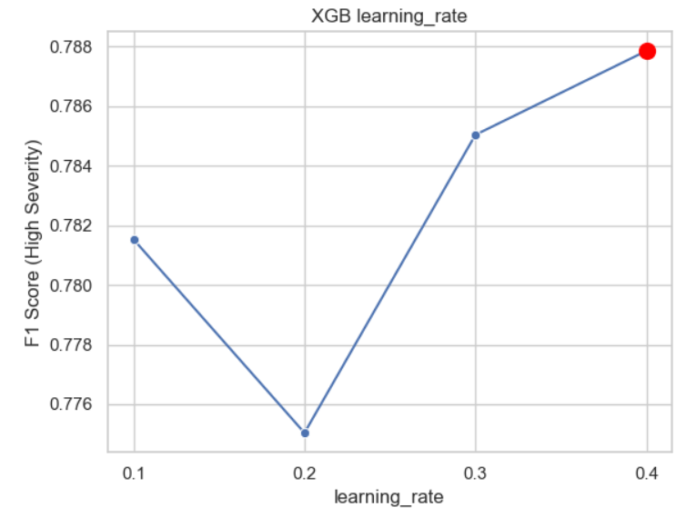
 

**Models tested:**
- `Random Forest` from scikit-learn
- `XGBoost` from XGBoost

**Metrics evaluated:**
`F1-score (macro-averaged)`
`Confusion matrices`
`K Fold Cross-validation`

## Class Balancing
*Located in:* 
> - [*notebooks/07_A_Fire_Ignition_Class_Balancing.ipynb*](https://github.com/dustinlit/California_Fire_Severity/blob/main/notebooks/07_A_Fire_Ignition_Class_Balancing.ipynb)
> - [*notebooks/07_B_Fire_Spread_Class_Balancing.ipynb*](https://github.com/dustinlit/California_Fire_Severity/blob/main/notebooks/07_B_Fire_Spread_Class_Balancing.ipynb)
> - [*notebooks/07_C_Fire_Damage_Class_Balancing.ipynb*](https://github.com/dustinlit/California_Fire_Severity/blob/main/notebooks/07_C_Fire_Damage_Class_Balancing.ipynb)

**Targets:** **Wildfire Damage Risk** and **Wildfire Spread Risk** are classified into five categories: from **Low (0)** to **High (4)**. Due to the nature of **Wildfire Ignition Risk**, it is modeled using a binary classification with **Low (0)** and **High (1)** categories.

**Issues:** Tn all three models, the majority class *vastly* outnumbers both other categories. Notably, high damaging wildfire events are severely underrepresented in the full dataset. 

**Balancing techniques tested**:
- In method class balancing
- Random UnderSampler (RUS) for the dominant "Low" class.
- SMOTE for oversampling

Overall, `Random UnderSampler` has the most positive effect on performance. While `SMOTE` seems to add to much noise to the models.

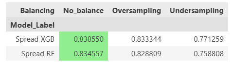
 

## Model Metrics
*Located in:* 
> - [*notebooks/08_A_Fire_Ignition.ipynb*](https://github.com/dustinlit/California_Fire_Severity/blob/main/notebooks/08_A_Fire_Ignition.ipynb)
> - [*notebooks/09_A_Fire_Spread.ipynb*](https://github.com/dustinlit/California_Fire_Severity/blob/main/notebooks/09_A_Fire_Spread.ipynb)
> - [*notebooks/10_A_Fire_Damage.ipynb*](https://github.com/dustinlit/California_Fire_Severity/blob/main/notebooks/10_A_Fire_Damage.ipynb)

**Key Findings:** 
- Most of the models are quite good at reliably identifying **low‑risk** grids, largely because the patterns associated with 'no wildfire activity' are abundant, consistent, and easy for algorithms to learn.
- The **Damage** and **Spread** models are also effective at recognizing the conditions that lead to the most destructive and largest wildfire events.
- The damage and spread models struggle to distinguish the **Moderate** classes due to the division of classes being relatively arbitrary. Assumptions require validation from subject experts to increase performance.

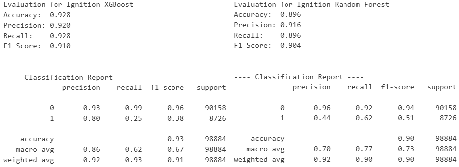
 
 

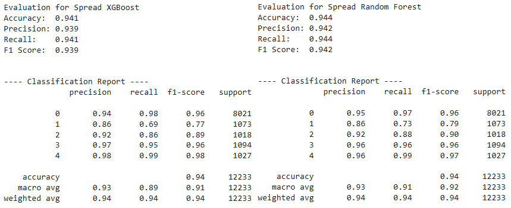
 
 

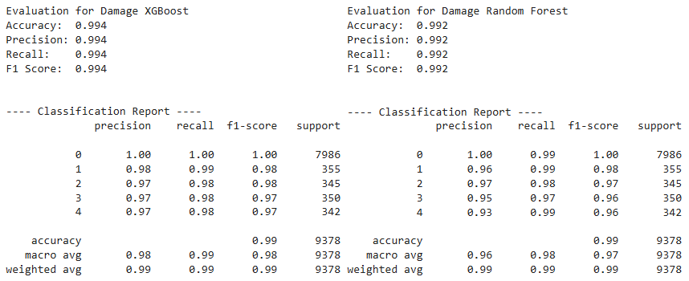
 

## SHAP Feature Influence:
*Located in:* 
> - [*notebooks/08_B_Fire_Ignition_Feature_Ablation.ipynb*](https://github.com/dustinlit/California_Fire_Severity/blob/main/notebooks/08_B_Fire_Ignition_Feature_Ablation.ipynb)

> - [*notebooks/09_B_Fire_Spread_Feature_Ablation*](https://github.com/dustinlit/California_Fire_Severity/blob/main/notebooks/09_B_Fire_Spread_Feature_Ablation.ipynb)

> - [*notebooks/10_B_Fire_Damage_Feature_Ablation.ipynb*](https://github.com/dustinlit/California_Fire_Severity/blob/main/notebooks/10_B_Fire_Damage_Feature_Ablation.ipynb)

 

### **Ignition Feature Importance**
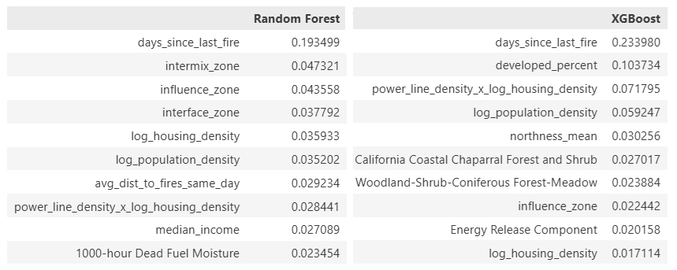

### **Spread Feature Importance**
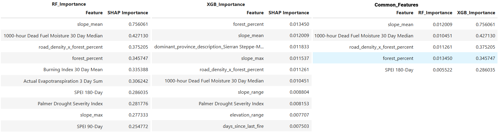

### **Damage Feature Importance**
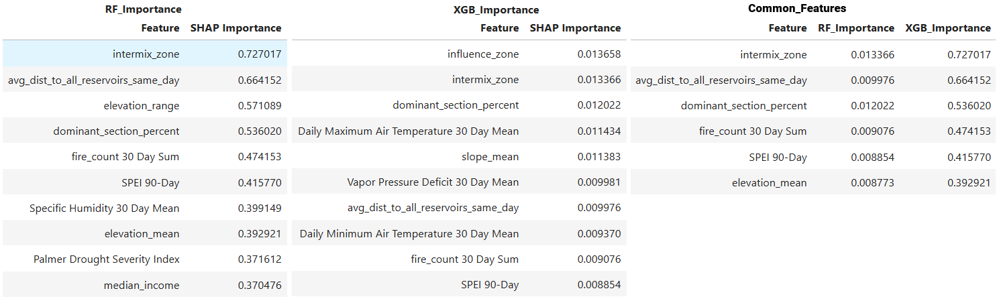

## Visualization:

### **Wildfire *Ignition* Predictions:**

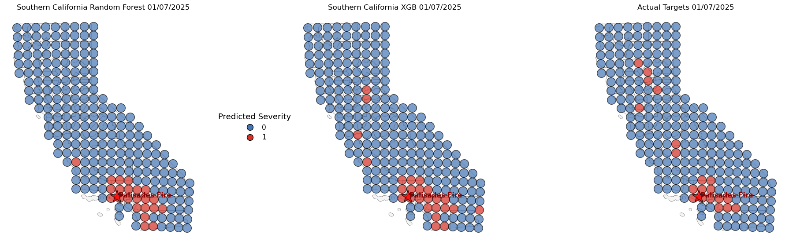
 

- **Wildland Urban Interface**, **Humans**, **Infrastructure** features contribute the most in both fire ignition models.
- **1000-hour Dead Fuel Moisture** is the highest performing weather feature. Dryness is the driving factor for ignition.

### **Wildfire *Spread* Predictions:**

 

- **Wildland Urban Interface** and **Human** features are the main contributors to both models.
- **Heat** and **Dryness** weather factors play key roles

### **Wildfire *Damage* Predictions:**

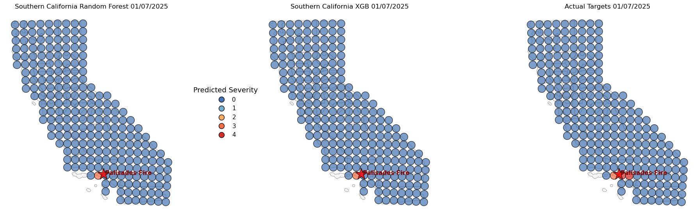

- The interaction of **Roads** and **Forests** has high signifigance in both models. May be due to fires started by cars in dry conditions. 
- **Dryness** features are the top climate driver. 

## Project Philosophy

#### Project Structure
I am attempting to structure this project in a way that mirrors the organization of a book. Each module is intended to function as a chapter, grouped by its high level purpose, for example, modeling fire damage, cleaning fire spread data, or engineering features.\
 
Within each chapter, I break each coding section into *paragraphs.* Each paragraph is a small, self contained operation with a clear purpose. These typically include a short markdown formatted header and high level explanation, with one to three code blocks. If a paragraph begins to grow too long, that’s a is signal to rethink the structure and break it into smaller, more focused pieces.\
 
The idea of this approach is to keep the entire codebase browsable and maintain a narrative structure. If I want to revisit how I compute lagged features, for example, I can go straight to the feature engineering chapter and find the relevant paragraph quickly.

#### Abstraction
I intentionally keep abstraction to a minimum. One level of abstraction is usually enough to keep the code efficient without obscuring underlying logic. In my experience, deeper abstraction tends to introduce unnecessary complexity, especially while the project is still growing. Refactoring highly abstracted functions often leads to cascading changes and unintended side effects that can quickly become a major distraction. By keeping things simple and direct, I can modify and extend the project without getting overwhelmed.

#### Function Arguments
I don’t enforce a strict limit on the number of arguments a function can take, but I treat four or more as a warning sign. When a function starts accumulating parameters, it usually means I’m trying to make it do too much. At that point, I pause and ask myself what the function is really doing and whether my logic can be simplified or reorganized. This habit helps prevent complexity from creeping in unnoticed.

#### Functionality Over Speed
Performance optimization is not my priority at this stage. My goal is to build the most accurate and conceptually sound wildfire risk model I can, and to use this project as a learning environment. The focus is on clarity, correctness, and understanding rather than optimizations.\
 
One of my major learning goals is to incorporate vectorized operations wherever possible. Python’s strength with large datasets comes from vectorization, and I want to grow more comfortable working with it. I still rely on loops in many places because that’s where my foundational programming stems from, but I occasionally take time to rewrite a loop in vectorized form to deepen my understanding. I don’t replace the original version until I fully grasp what the vectorized version is doing.\
 
This is why some parts of the project, especially the large buffered spatial joins, remain slow. Two modules currently account for about half of the total runtime. While I know there are more efficient approaches, I am intentionally leaving them as is until I understand the alternatives well enough to implement them.

#### Assumptions
I am not a formal climate scientist and wildfire modeling involves many potential subjective choices like wildfire buffer distances, lag windows, thresholds, and spatial resolutions. I try to document these assumptions at the point where they are introduced and used. I want each assumption to be visible and contextual to keep the project transparent and easier to review or revise later.

#### Long Term Vision
This project began as a portfolio piece, but it has grown into something more personal. I’m genuinely interested in wildfire modeling, and I want to continue improving the accuracy and sophistication of the models as my skills grow. My intention is for this project to evolve alongside me, a long term research effort rather than a static artifact.

## Project Challenges
- **Dataset size** - As Additional data is constantly added and overall spatial granularity is increased, ***processor times are becoming prohibitively large and unwieldy*** on current hardware. It has become a balancing act to subset the dataset for efficient workflow without overly affecting model performance.
- **Heavy Class Imbalance** - Damaging wildfire events are rare compared to days with no significant events. The low risk class composes the overwhelming majority of the total data points. Moderate and high risk events only compose **3.6%**. In testing, `Undersampling` the majority class works best for balancing, while oversampling the minority class tends to *add too much noise* to the models.
- **Messy Real World Data** - You don’t have to get far from clean, well‑curated datasets before you run into the real messiness of actual data. Agencies do solid work organizing what they need, but connecting all those pieces is another challenge. You end up dealing with big gaps, missing or low‑resolution spatial info, and the occasional random error that throws everything off. Some days it feels like a data rodeo and sometimes the bull wins.
- **Fire Complexity** - Large, damaging fires can burn for days and grow at very different rates, and many datasets don’t consistently track containment times. Because of that, relying only on ignition dates makes it difficult to accurately model when fires spread or how much damage they ultimately cause.
- **Spatial Resolution** - My current hardware limits how finely I can analyze the state. As a result, some variables, like slope and wind speed, get averaged out or flattened, leading to overgeneralization and loss of important detail.

## Personal Challenges
The primary journey of this project has always been to learn more about spatial data science, practice and expand `ArcGIS` skills, and get more valuable practical `python` coding experience. While I have grown tremendously in all of these areas, but taking on something this large also surfaced a few challenges I didn’t fully expect going in.
  
**Identifying and Preventing** ***Data Leakage***:
I chalk this lesson up to being a classic rookie mistake. I initially believed I understood how to avoid data leaks, but I have learned that they can be subtle and deceptive. Often, moments where i feel 'finally nailed it' are followed by the sudden realization that there is liekly an apparent leak hiding somewhere. As a result, I now approach any sudden performance bumps with caution and double check any feature engineering or introduction of new data.

**Maintaining a Cohesive Project Structure**
This project began as a simple Jupyter notebook page, soon expanded to five, and has now grown into 12+ modules, 4+ appendices, and multiple source files. As the project scales, handling and passing data throughout these modules has become more complex and sometimes bugs or changes became more difficult to trace and more time consuming. Consistent organization throughout modules along with clear communication of inputs and outputs are now essential to keeping the structure manageable and growing.

**Knowing the Proper time to Document and Analyze Variables**
There is no argument that documentation and analysis are crucial parts to a project. Ultimately, I have spent many hours documenting variables and structures that appeared complete, only to have to be completely rewritten or revised. I now document with simple headers and critical notes only, reserving more detailed documentation for when a module is closer to completion. This approach ensures I maintain clarity and speed throughout development.

## Next Steps / Potential Improvements
- Re-evaluate damage model structure. Maybe change to regression with dollar amount.
- Hot Spot analysis of daily NDVI raster data (in process)
- Spatial correlation examination with Morans I. (in process)
- ArcGIS online integration.
- Incorporate emergency response times and reservoir data (in process)
- Time series maps to check models consistency over time
- Seperate module for up to date processing of new information and real time predictions
- Consult domain experts to validate assumptions and feature selection.

## Changelog:

### Version 4.0 Changelog
> 1. Seperated targets into three main models, **Fire Ignition**, **Fire Spread**, and **Fire Damage**.
> 2. New Datasets
>   - Detailed Elevation incorporated (slope, aspect, northness, eastness)
>   - Infrastructure data (road density, power line density)
>   - Land Cover raster data
> 3. New refined and detailed ArcGIS worklow
> 4. Changed samples from points to a raster grid structure to ensure even coverage of the state with minimal overlap.
> 5. Removed the Neural Network due to consistent poor performance (may be due to hardware limitations)
> 6. Incorporated interaction features modeling `Slope x Wind`, `Human x Environment`, `Wind Speed x Dryness`
> 7. Added one hot encoding of regional and temporal fields. `Seasons`, `Eco Regions`
> 8. Expanded the target to take into account the `Days Burned` of each fire, since fire spread and damage do not only take place on the day of ignition.

### Version 3.0 Changelog

> 1. Incorporated more accurate and complete raster weather data from **gridMET Climatology Lab**
> 2. Integrated **Wildland Urban Interface** and **California Eco regions**.
> 2. Replaced the `KNN` model with a `Neural Network` for a simpler data workflow.
> 3. ArcGIS Pro integration for data preparation and prediction interpolation
> 4. Added more accurate Census Block data. Population stats calculated as buffer zone around sampling points.

### Version 2.0 Changelog

> 1. Added Detailed fire damage data
>       - CALFIRE damage cost data added, 
>       - Estimation of damage directly from structures
> 2. Expanded the dates for weather and damage data
>       - Expanded from 2018-2020 to 2018-2025
> 3. New Features
>       - `Fire History` average fires per month for previous years
> 4. Data Handling Optimization
>       - Simplified handling of case study data as references instead of storing separate databases
> 5. Geographical and Temporal Integration
>       - in ArcGIS, constructed a mesh sampling grid in California to ensure even coverage
>       - Buffer spatial join for combining fire damage info with weather data
>       - Incorporated Regionality and Seasonality into models.

## Installation
To run the project locally:\
git clone https://github.com/dustinlit/wildfire-severity.git \
cd wildfire-severity\
pip install -r requirements.txt

## License
This project is released under the MIT License.
See LICENSE for details.