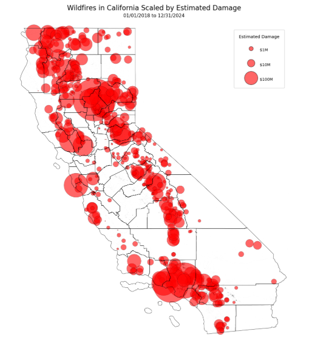
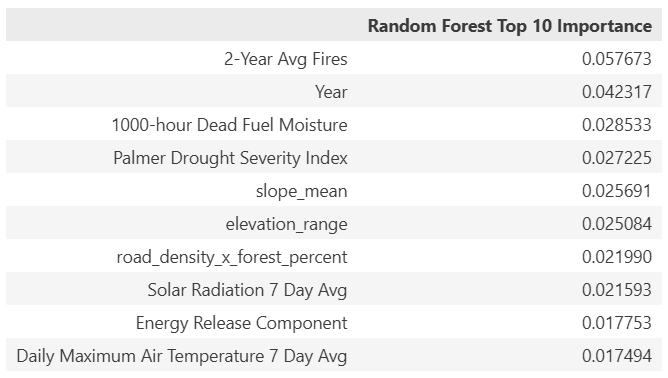
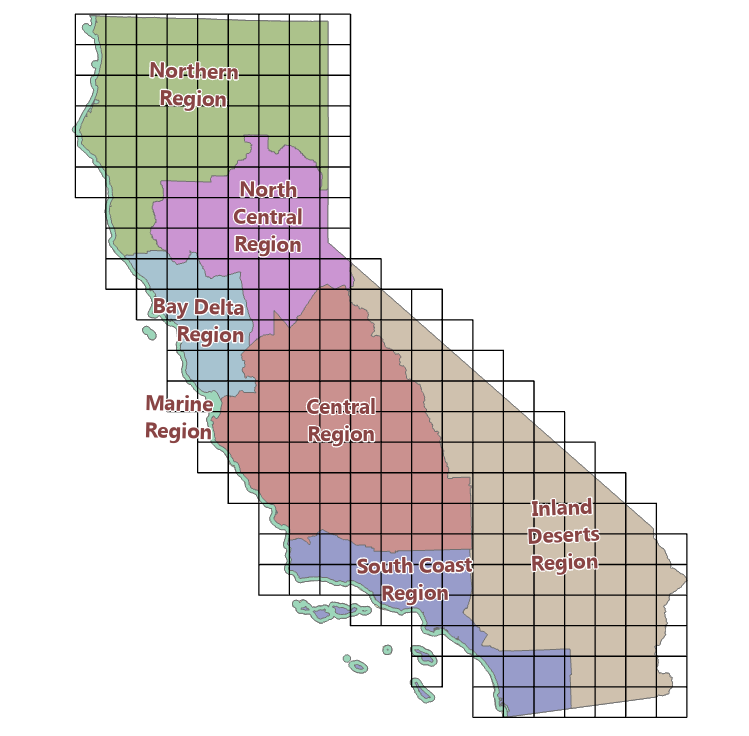
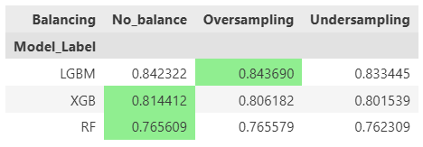
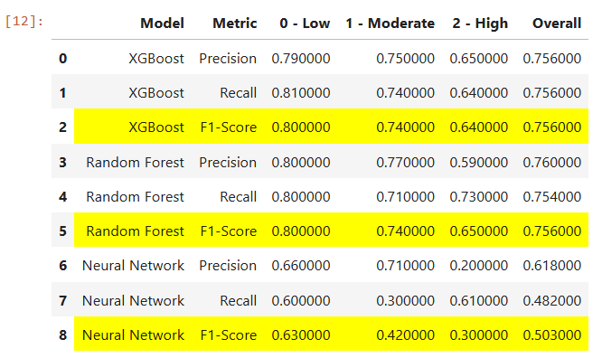
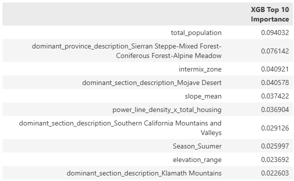
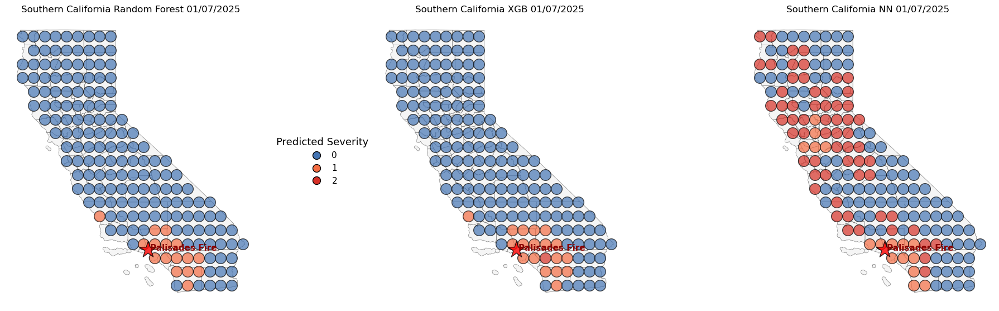

# Mapping the Potential Destructive Power of Wildfires Using Machine Learning
*Version 4.0*

Author: Dustin Littlefield\
Project Type: Data Science & GIS Portfolio\
Technologies: ArcGIS, Python, Pandas, Scikit-learn, XGBoost, GeoPandas, Matplotlib\
Skills: `Data cleaning` `feature engineering` `supervised machine learning` `model evaluation` `class imbalance handling` \
`spatial visualization` `exploratory data analysis` `reproducible workflow design` `results communication`\
Status: In Progress\
Last Updated: December 2025\
[Github Repository](https://github.com/dustinlit/California_Fire_Severity)

**Disclaimer:** I am not a climate scientist or wildfire expert. This project is intended to demonstrate data science, geospatial, and machine learning skills. It is not designed for operational use or policy decisions.

## Overview
This project is a work in progress that explores the relationship between wildfire severity and environmental, geographical, social and temporal factors in the state of California. The goal is to predict a custom severity index `Wildfire Potential Destructive Power` — which incorporates structures damaged, structures destroyed and acres burned as degrees of fire severity.

## Objectives
- Predict wildfire damage potential based on environmental, geographical and social data.
- Extrapolate statewide wildfire coverage by integrating daily weather data and fire records through analysis of a grid network across California.
- Analyze daily time series data spanning **5 years** of California wildfire history and weather.
- Integrate ArcGIS for **spatial analysis**, results interpretation, and to aid in the construction of the dataset.
- Compare several multi-classification modelling techniques with a focus on tree models like `XGBoost`,`Random Forest`, and  `Light GBM`.
- Compare class balancing techniques between `RandomUnderSampler`, `SMOTE`, and unbalanced and measure their effect on model performance.
- Utilize interpolation techniques on results to create geospatial visualizations that illustrate local and regional risk patterns as they evolve over time.
- Analyze and identify the most important relationships between wilfire severity and risk factors.

## Key Initial Insights:
- In the grid network, there were a total of **132,810** incidents of wildfires detected between 01/01/2018 and 12/31/2024 thoughout the state.
- **24,890** of these were *high* risk incidents causing significant property damage or acreage burned.
- Models are currently performing with an **85% F1 score** with tree based models like `XGBoost` capturing the complicated relationships the best.
- Wildfire events appear to be increasing over time. `Year` is a strong contributor to the models.
- Human factors weigh heavily in the models, `Population` and `Housing` density contribute substantially to the random forest model (the best performer).
- Regional factors like `WUI interface` and `WUI intermix` zones contribute reasonably as well.
- Standalone weather factors are poor predictors of fire severity.

Example Results:

 

## Initial Challenges
- **Dataset size** - The additional datasets and higher spatial granularity are leading to ***prohibitively large and unwieldy processor times*** on current hardware. It has become a balancing act to trim the dataset for efficient workflow without overly affecting model performance.
- **Heavy Class Imbalance** - Damaging wildfire events are rare compared to days with no significant events. The low risk class composes **78%** of the total data points compared to the high risk class which is only **4%** of the data. `Undersampling` the majority class works best for balancing, while oversampling the minority class tends to *add too much noise* to the models.
- **Messy Real World Data** - Data with large gaps, data without spatial fields or too low resolution, data in which you have to wrangle random mistakes. Some days feel like a rodeo, so many promising avenues become dead ends due to the potential time sink.
- **Fire Complexity** - Damaging fires often persist for many days. Utilizing fire ignition dates alone is insufficient to predict the potential for damage.
- **Spatial Granularity** - Hardware limits the resolution at which regions can be analyzed. Overgeneralization of data, like slope and aspect, occurs frequently and makes widespread prediction more difficult.

### Version 4.0 Changelog

> 1. New Datasets
>     - Detailed Elevation incorporated (slope, aspect, northness, eastness)
>     - Infrastructure data (road density, power line density)
>     - Land Cover raster data
> 2. New refined and detailed ArcGIS worklow
> 3. Changed samples from points to a grid structure to ensure even coverage of the state with minimal overlap.
> 4. Replaced Neural Network with LightGBM tree model due to consistent poor performance (may be due to hardware limitations)
> 5. Incorporated interaction features modeling `Slope x Wind`, `Human x Environment`, `Wind Speed x Dryness`
> 6. Added spatial features to modeling. `centroid location`, `latitude`, `longitude`
> 7. Added one hot encoding of regional and temporal fields. `Seasons`, `Eco Regions`
> 8. Expanded the target to take into account the `Days Burned` of each fire, since fire spread and damage do not only take place on the day of ignition.

### Version 3.0 Changelog

> 1. Incorporated more accurate and complete raster weather data from **gridMET Climatology Lab**
> 2. Integrated **Wildland Urban Interface** and **California Eco regions**.
> 2. Replaced the `KNN` model with a `Neural Network` for a simpler data workflow.
> 3. ArcGIS Pro integration for data preparation and prediction interpolation
> 4. Added more accurate Census Block data. Population stats calculated as buffer zone around sampling points.

### Version 2.0 Changelog

> 1. Added Detailed fire damage data
>       - CALFIRE damage cost data added, 
>       - Estimation of damage directly from structures
> 2. Expanded the dates for weather and damage data
>       - Expanded from 2018-2020 to 2018-2025
> 3. New Features
>       - `Fire History` average fires per month for previous years
> 4. Data Handling Optimization
>       - Simplified handling of case study data as references instead of storing separate databases
> 5. Geographical and Temporal Integration
>       - in ArcGIS, constructed a mesh sampling grid in California to ensure even coverage
>       - Buffer spatial join for combining fire damage info with weather data
>       - Incorporated Regionality and Seasonality into models

## Project Structure

California_Fire_Severity/\
├── data/\
├── notebooks/\
│ ├── 01_Data_Exploration.ipynb\
│ ├── 02_Data_Merging.ipynb\
│ ├── 03_Feature_Engineering.ipynb\
│ ├── 04_Variable_Selection.ipynb\
│ ├── 05_Feature_Interaction_Analysis.ipynb\
│ ├── 06_Class_Balancing.ipynb\
│ ├── 07_Modeling_and_Tuning.ipynb\
│ ├── 08_Evaluation_and_Visualization.ipynb\
│ ├── A_Appendix_Sampling_Grids.ipynb\
│ ├── B_Appendix_Wildfires.ipynb\
│ ├── C_Appendix_Gridmet_Combination.ipynb\
│ ├── D_Appendix_Gridmet_Extraction.ipynb\
├── plots/\
│ ├── Palisades_predictions.png\
│ ├── Interpolated.png\
│ ├── sampling_metrics.png\
│ └── file_structure.png\
├── src/\
├── Optimizing_Emergency_Response.pdf\
├── README.ipynb\
└── README.md

## Data Sources

> **Fire Incident Data**:

 - **Wildfire damage data**: *CAL FIRE Damage Inspection (DINS)* <https://data.ca.gov/dataset/cal-fire-damage-inspection-dins-data>'
 - **Wildfire incidents**: *Calfire Incidents* <https://www.fire.ca.gov/incidents>

> **Environmental Data**:

- **Daily weather readings**: *gridMET* <https://www.climatologylab.org/gridmet.html>
- **Land Cover**: *USGS* <https://data.cnra.ca.gov/dataset/nlcd-2021-land-cover-california-subset/resource/6dab6b30-88ae-4aec-af8c-c22d52593c75>

> **California Demographic Data** :

 - **Census Tract Data**: *U.S. Census Bureau, Department of Commerce* <https://catalog.data.gov/dataset/tiger-line-shapefile-2021-state-california-census-tracts>
 - **2024 American Community Survey 5 year Median Income Data** *U.S. Census Bureau, Department of Commerce* <https://data.census.gov/table/ACSST1Y2024.S1903?q=California+Income&g=010XX00US$1500000_040XX00US06$1400000,06$1500000>

> **Wildlife Urban Interface**: 

- **WUI layer**: *California Department of Forestry and Fire Protection* <https://gis.data.ca.gov/datasets/CALFIRE-Forestry::wildland-urban-interface/explore?location=34.403601%2C-118.894358%2C9.95>
- **CDFW regions**: *California Department of Fish and Wildlife* <https://data.ca.gov/dataset/cdfw-regions>
- **Eco Regions** - *USDA Forestry Service* <https://data.fs.usda.gov/geodata/edw/datasets.php?dsetCategory=biota>

> **Elevation**: 

- **1/3 arc-second DEMs**: *USGS National Map* <https://apps.nationalmap.gov/downloader/>

> **Infrastructure**: 

- **All Public Roads**: *CalTrans* <https://apps.nationalmap.gov/downloader/>
- **Transmission lines**: *California Energy Commission (CEC)* <https://www.arcgis.com/home/item.html?id=aaa6321660eb40bbb55755d5cfb64107>

**Raw Data Processing in:**
> - [*notebooks/A_Appendix_Sampling_Grids.ipynb*](https://github.com/dustinlit/California_Fire_Severity/blob/main/notebooks/A_Appendix_Sampling_Grids.ipynb)
> - [*notebooks/B_Appendix_Wildfires.ipynb*](https://github.com/dustinlit/California_Fire_Severity/blob/main/notebooks/B_Appendix_Wildfires.ipynb)
> - [*notebooks/C_Appendix_Gridmet_Combination.pynb*](https://github.com/dustinlit/California_Fire_Severity/blob/main/notebooks/C_Appendix_Gridmet_Combination.ipynb_)
> - [*notebooks/D_Appendix_Gridmet_Extraction.pynb*](https://github.com/dustinlit/California_Fire_Severity/blob/main/notebooks/D_Appendix_Gridmet_Extraction.ipynb)

## Key Factors:
Environmental / Weather Variables:
- `Air Temperature`-	Daily maximum and minimum air temperature at 2 meters above ground (Kelvin)
- `Vapor Pressure Deficit` - kPa Difference between saturation vapor pressure and actual vapor pressure (kPa); indicates atmospheric drying power
- `Relative Humidity`	-Maximum daily relative humidity (%) at 2 meters
- `Wind Speed` - Daily wind speed (m/s) at 10 meters
- `Actual Evapotranspiration`	- Estimated evapotranspiration from actual vegetation (mm/day)
- `Palmer Drought Severity Index`	- Long-term drought index combining temperature and precipitation to measure dryness
- `Standardized Precipitation Index` - Short-term precipitation deficit; captures recent drying of fine fuels

Fire Danger Indicators:
- `Burning_Index`	- Fire danger index derived from temperature, humidity, wind, and fuel moisture; higher values indicate higher fire potential
- `Energy_Release_Component` - Estimated energy release per unit area (MJ/m²); relates to potential fire intensity
- `Dead_Fuel_Moisture` - Moisture content of medium-size dead fuels (%) affecting fire spread

Temporal and Spatial Variables:
 - `Season`,`Year`,`Centroid Location`

Sampling Grid Data:
- `Interface`, `Intermix`, and `Influence` Areas - From WUI, average area of each zone within 36KM Buffer radius around sampling points
- `Total_Population`,`Population_Density`,`Total_Housing`,`Housing_Density` - Population and housing statistics within 36KM Buffer radius around sampling points
- `Eco_Regions` - regions generally representing the varied climate and vegetative regions in California
- `Slope`,`Aspect` Derived from high resolution USGS daily rasters 
- `Land Cover` Derived from land cover raster
- `Roads`,`Power Lines`

**Data Exploration:**
> - [*notebooks/01_Data_Exploration.ipynb*](https://github.com/dustinlit/California_Fire_Severity/blob/main/notebooks/01_Data_Exploration.ipynb)
> - [*notebooks/02_Data_Merging.pynb*](https://github.com/dustinlit/California_Fire_Severity/blob/main/notebooks/02_Data_Merging.ipynb)

## ArcGIS Sampling Grid:

### Key Fields in Grids
 

<table border="1" class="dataframe">
  <thead>
    <tr style="text-align: right;">
      <th></th>
      <th>Field Name</th>
      <th>Alias</th>
      <th>Data Type</th>
      <th>Description</th>
      <th>Units</th>
      <th>Category</th>
    </tr>
  </thead>
  <tbody>
    <tr>
      <th>3</th>
      <td>Influence_Zone</td>
      <td>Influence Zone</td>
      <td>Double</td>
      <td>Total amount io influence areas within each grid</td>
      <td>square meters</td>
      <td>WUI</td>
    </tr>
    <tr>
      <th>4</th>
      <td>interface_zone</td>
      <td>Interface</td>
      <td>Double</td>
      <td>Total amount io interface areas within each grid</td>
      <td>square meters</td>
      <td>WUI</td>
    </tr>
    <tr>
      <th>5</th>
      <td>intermix_zone</td>
      <td>Intermix</td>
      <td>Double</td>
      <td>Total amount io intermix areas within each grid</td>
      <td>square meters</td>
      <td>WUI</td>
    </tr>
    <tr>
      <th>6</th>
      <td>dominant_province_description</td>
      <td>Province Description</td>
      <td>Text</td>
      <td>Ecoregion province that makes up the most area in each grid</td>
      <td>none</td>
      <td>Region</td>
    </tr>
    <tr>
      <th>7</th>
      <td>dominant_province_percent</td>
      <td>Dominant Province Percent</td>
      <td>Double</td>
      <td>Percentage of ecoregion province that makes up the most area in each grid</td>
      <td>none</td>
      <td>Region</td>
    </tr>
    <tr>
      <th>9</th>
      <td>dominant_section_description</td>
      <td>Section Description</td>
      <td>Text</td>
      <td>Ecoregion section that makes up the most area in each grid</td>
      <td>none</td>
      <td>Region</td>
    </tr>
    <tr>
      <th>11</th>
      <td>dominant_section_percent</td>
      <td>Dominant Section Percent</td>
      <td>Double</td>
      <td>Total area of ecoregion section that makes up the most area in each grid</td>
      <td>square meters</td>
      <td>Region</td>
    </tr>
    <tr>
      <th>14</th>
      <td>forest_percent</td>
      <td>Forest Percent</td>
      <td>Long</td>
      <td>Percent of forest land in each grid</td>
      <td>none</td>
      <td>Fuel</td>
    </tr>
    <tr>
      <th>15</th>
      <td>developed_percent</td>
      <td>Developed Percent</td>
      <td>Long</td>
      <td>Percent of developed land in each grid</td>
      <td>none</td>
      <td>Fuel</td>
    </tr>
    <tr>
      <th>16</th>
      <td>other_percent</td>
      <td>Other Percent</td>
      <td>Long</td>
      <td>Percent of other (water,desert) land in each grid</td>
      <td>none</td>
      <td>Fuel</td>
    </tr>
    <tr>
      <th>17</th>
      <td>shrub_grass_percent</td>
      <td>Shrub/Grass Percent</td>
      <td>Long</td>
      <td>Percent of shrub/grasslands land in each grid</td>
      <td>none</td>
      <td>Fuel</td>
    </tr>
    <tr>
      <th>18</th>
      <td>wetlands_percent</td>
      <td>Wetlands Percent</td>
      <td>Long</td>
      <td>Percent of wetlands land in each grid</td>
      <td>none</td>
      <td>Fuel</td>
    </tr>
    <tr>
      <th>19</th>
      <td>elevation_range</td>
      <td>Elevation Range</td>
      <td>Double</td>
      <td>Difference between the minimum and maximum elevation in each grid</td>
      <td>meters</td>
      <td>Elevation</td>
    </tr>
    <tr>
      <th>20</th>
      <td>elevation_mean</td>
      <td>Elevation Mean</td>
      <td>Double</td>
      <td>Average elevation in each grid</td>
      <td>meters</td>
      <td>Elevation</td>
    </tr>
    <tr>
      <th>22</th>
      <td>slope_max</td>
      <td>Slope Max</td>
      <td>Double</td>
      <td>Maximum slope in each grid</td>
      <td>degrees</td>
      <td>Elevation</td>
    </tr>
    <tr>
      <th>24</th>
      <td>slope_mean</td>
      <td>Slope Mean</td>
      <td>Double</td>
      <td>Average slope in each grid</td>
      <td>degrees</td>
      <td>Elevation</td>
    </tr>
    <tr>
      <th>26</th>
      <td>northness_mean</td>
      <td>Northness Mean</td>
      <td>Double</td>
      <td>How strongly the slopes in the grid faces north (-1 to 1)</td>
      <td>none</td>
      <td>Elevation</td>
    </tr>
    <tr>
      <th>27</th>
      <td>eastness_mean</td>
      <td>Eastness Mean</td>
      <td>Double</td>
      <td>How strongly the slopes in the grid faces east (-1 to 1)</td>
      <td>none</td>
      <td>Elevation</td>
    </tr>
    <tr>
      <th>28</th>
      <td>median_income</td>
      <td>Mean Median Income</td>
      <td>Double</td>
      <td>Median income in each grid</td>
      <td>dollars</td>
      <td>Social</td>
    </tr>
    <tr>
      <th>31</th>
      <td>road_density</td>
      <td>Road Density</td>
      <td>Double</td>
      <td>Total density of roads in each grid</td>
      <td>1/meters</td>
      <td>Infrastructure</td>
    </tr>
    <tr>
      <th>33</th>
      <td>power_line_density</td>
      <td>Density of Power Lines</td>
      <td>Double</td>
      <td>Total density of power lines in each grid</td>
      <td>1/meters</td>
      <td>Infrastructure</td>
    </tr>
    <tr>
      <th>34</th>
      <td>total_housing</td>
      <td>Total Housing</td>
      <td>Double</td>
      <td>Count of all housing units in each grid</td>
      <td>house</td>
      <td>Social</td>
    </tr>
    <tr>
      <th>37</th>
      <td>population_density</td>
      <td>Population Density</td>
      <td>Double</td>
      <td>Density of population in each grid</td>
      <td>peopl/square meter</td>
      <td>Social</td>
    </tr>
  </tbody>
</table>

## Feature Engineering
*Located in:* 
> - [*notebooks/03_Feature_Engineering.pynb*](https://github.com/dustinlit/California_Fire_Severity/blob/main/notebooks/03_Feature_Engineering.ipynb)
> - [*notebooks/04_Variable_Selection.pynb*](https://github.com/dustinlit/California_Fire_Severity/blob/main/notebooks/04_Variable_Selection.ipynb)

Engineered Data:
- `Santa_Ana_Score` - Winds x dryness score to represent the influence of these winds.
- `Average_Fires_per_Month` - Historical 2 year rolling average count of fires per county
- `7-day_Lagged_Weather` - rolling 7 day average for key weather variables

## Class Balancing (Updating)
*Located in:* 
> - [*notebooks/06_Class_Balancing.ipynb*](https://github.com/dustinlit/California_Fire_Severity/blob/main/notebooks/06_Class_Balancing.ipynb)

**Target:** *Wildlife Potential Destructive Power* - categorized into Low (0), Moderate(1), High(1)

**Issues:** Moderate and High Damage wildfire events classes are underrepresented.

Balancing Techniques Used:
- In method class balancing
- Random UnderSampler for the dominant "Low" class.
- SMOTE for oversampling

Automatic comparison and selection of class balancing strategies.

## Modeling
*Located in:*
> - [*notebooks/07_modeling_And_Tuning.ipynb*](https://github.com/dustinlit/California_Fire_Severity/blob/main/notebooks/07_Modeling_and_Tuning.ipynb)

Models are tuned automatically and the best performing models are selected for final evaluation and visualization.

**Models tested:**
- `Random Forest` from scikit-learn
- `Light GBM` from scikit-learn
- `XGBoost` from XGBoost

**Metrics evaluated:**
`F1-score (macro-averaged)`
`Confusion matrices`
`Cross-validation`

Feature importance extracted for tree-based models.

## Model Metrics

**Key Findings:** 
- All Models struggle with distinguishing **Moderate** from **High** severity classes.
- Tree models performed comparably, may need further tuning
- Neural Network currently struggles

### Metrics for real world case study: `Palisades Fire` - 01/07/2025: (Updating)

## **Feature Importances** for Tree models:

## Conclusions:
- **Historical** trends featured heavily in the Random Forest model.
- **Regional** and **Human** data had the most influence in the XGBoost model.
- Most **weather** Variables rank low on model importance suggesting a more complicated relationship with wildfire severity
- **Population** stats play a key role in prediciting wildfire severity
- More data may be neccessary for better correllations

## Visualization (updating)
*Located in:*
> - [*notebooks/08_evaluation_and_visualization.ipynb*](https://github.com/dustinlit/California_Fire_Severity/blob/main/notebooks/08_Evaluation_and_Visualization.ipynb)

- Maps using GeoPandas, Matplotlib, and Seaborn.
- IDW interpolation for environmental variables in ArcGIS.

Example Python Output:

---

## Next Steps / Potential Improvements
- Hot Spot analysis of daily NDVI raster data (in process)
- Spatial correlation examination with Morans I.
- Arcpy integration.
- Incorporate emergency response times and reservoir data
- Time series maps to check models consistency over time
- Seperate module for up to date processing of new information and real time predictions
- Consult domain experts to validate assumptions and feature selection.

## Installation
To run the project locally:\
git clone https://github.com/dustinlit/wildfire-severity.git \
cd wildfire-severity\
pip install -r requirements.txt

## License
This project is released under the MIT License.
See LICENSE for details.